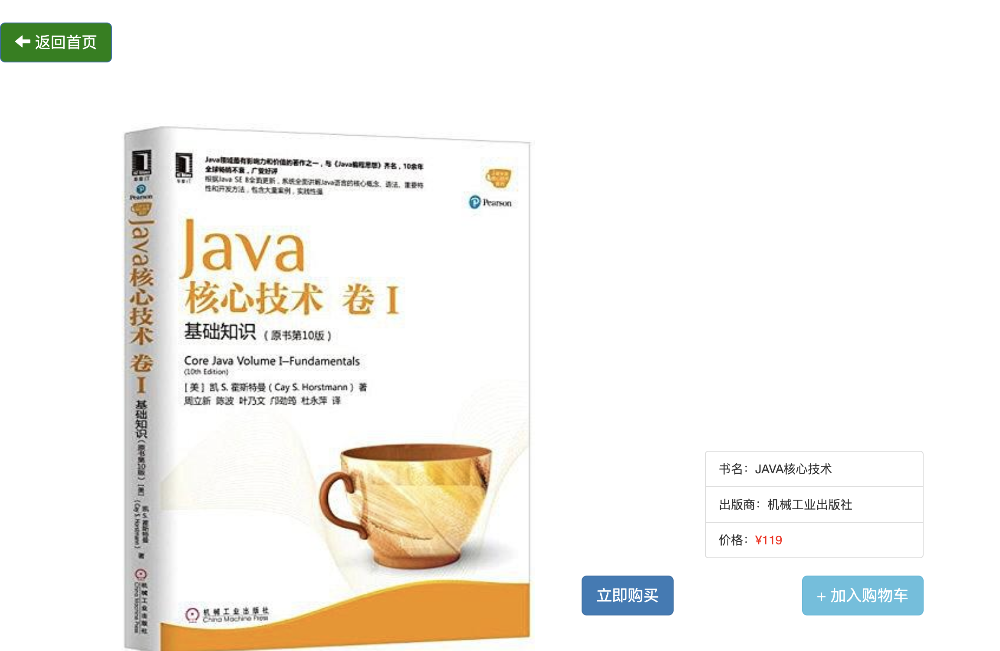

### 今天主要完成了书籍详情页面的实现和点击立刻购买的实现：

书籍详情页：由于只是一个小的练手项目，便没有在数据上面花很大的开销。这也是本项目一个很大的不足点。思路：点击书籍-->将书籍id传给servlet，后端servlet把书籍信息封装为JSON数据，然后返回结果，贴一张图，有点难看。。（没有在前端界面美化上面再花时间了）

之后实现了立即购买按钮：

实现也很简单，点击立即购买，检查用户权限(cookie)，检查成功，显示购买完成。检查失败，跳转至登录界面即可