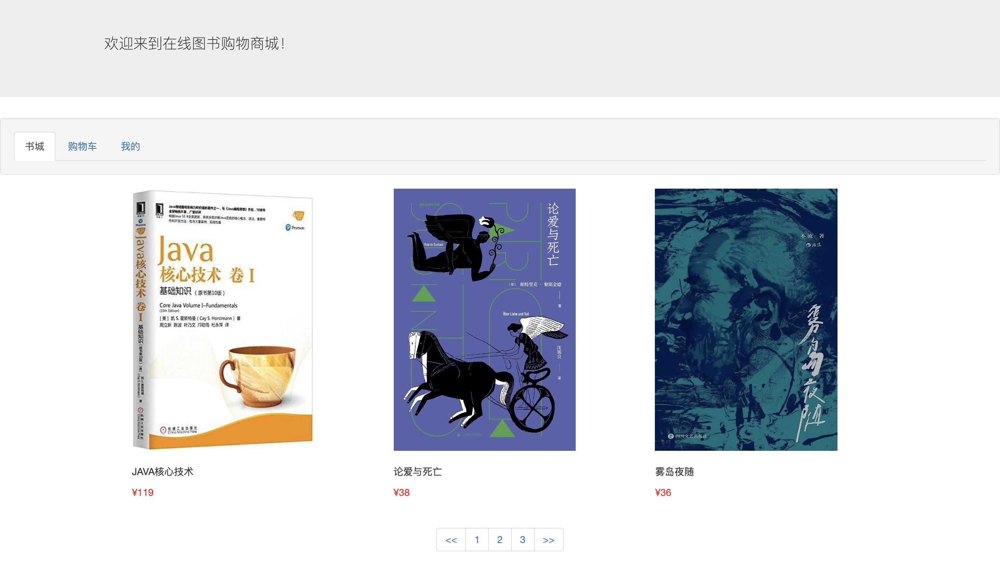

#### 首页剩余部分的设计完成

今天完成了首页剩余部分的设计，经历了前几天的bug地狱折磨，疯狂查找资料文章后，大概对servlet的创建和部署等有了一些认识，基本没遇到什么bug就完成了首页的设计。

##### 使用@WebServlet( )来减少向web.xml中注册servlet

##### 在init()中初始化的对象，会存在于整个tomcat运行期间，所以做完每次请求后应该根据情况把对象重新赋值

### 前端设计

采用很简洁的设计，因为主要工作不在前端，使用bootstrap和vuejs快速搭建前端并绑定数据。

#### 分页功能：

首页使用了分页显示图书的功能，由两个servlet接收两次请求来完成。

##### 第一个servlet,名为PageBooks

该servlet接受不了两个参数，一个是第几页pageNo，一个是一页显示多少本书pageNum。

**思路**：接收参数--->判断是否已经不能再请求更多图书，即上一页已经是最后一页--->还可以请求，则计算出id范围---->DAO查询数据库---->返回请求图书

##### 第二个servlet，名为PageNumbers

该servlet接收一个参数，一页多少本书pageNum。主要用于页面渲染，即下面应该有多少页1，2......

**思路**：很简单啦，就是计算出总共多少页然后以JSON数据返回给前端

长这样  ⬇️ 

### 技术难点：

1，页数的确定和页数的渲染：我使用了两个变量，一个是总图书数，一个是一页的图书数。返回json数据，即

```javascript
[{
  page:1
},{
  page:2
},{
  page:3
}]
```

这种方式进行渲染

2，分页功能的实现，当切换页面的时候如何重新发起请求并重新渲染数据：这里我使用了vueJs的双向数据绑定的方式，在发起请求后改变数据，同时也就改变了视图