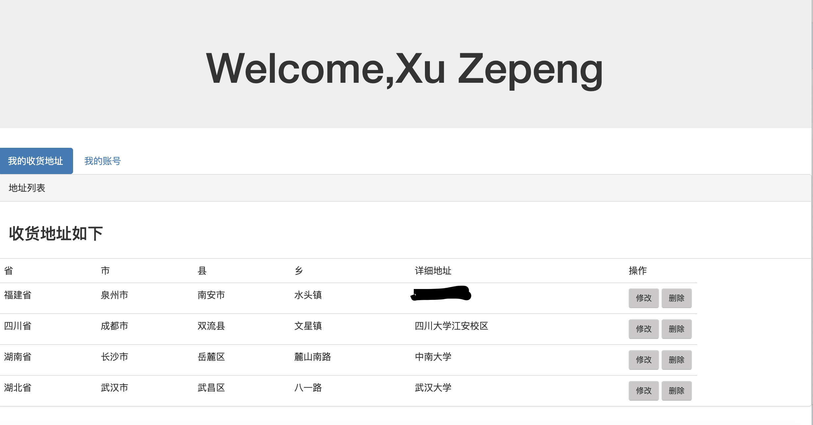
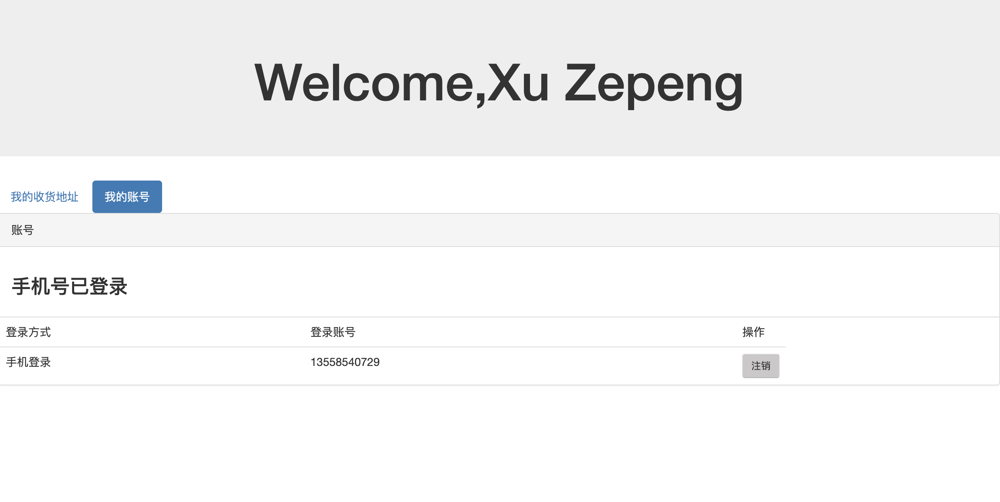

#### 完成了登录成功后的界面

界面简洁，而且简单。。因为没有用多少数据，功能也不多，毕竟只是个小项目

#### 思路：

采取直接显示数据的方式，从后端根据登录手机号选择数据。

1，首先根据客户端发送的cookie进行用户验证，每个cookie的maxAge我设置成的100s

2，验证成功则继续，不成功返回fail字符串，然后servlet返回

3，先从用户表中选取用户数据，返回用户数据，留下用户id

4，再从用户地址表中选取地址id，即一个数组

5，再根据地址id在地址表中选取详细地址数据，返回前端显示

6, 设置一个新的cookie,名为addrs，值为所有地址id以下划线连接，如1_2_3_4_ ，目的是为之后的更改地址和删除地址设置“通行证”

### 技术难点：

cookie操作：对cookie进行操作，将resp.getCookies()赋值为一个cookie数组，然后进行cookie操作即可

页面渲染：比如点击一个按钮另一个按钮应该消失掉点击的颜色，同时使用display:none隐藏刚才的界面，使用display:block显示点击按钮前被隐藏的界面。贴两张界面图，很简洁

地址列表

我的账号

