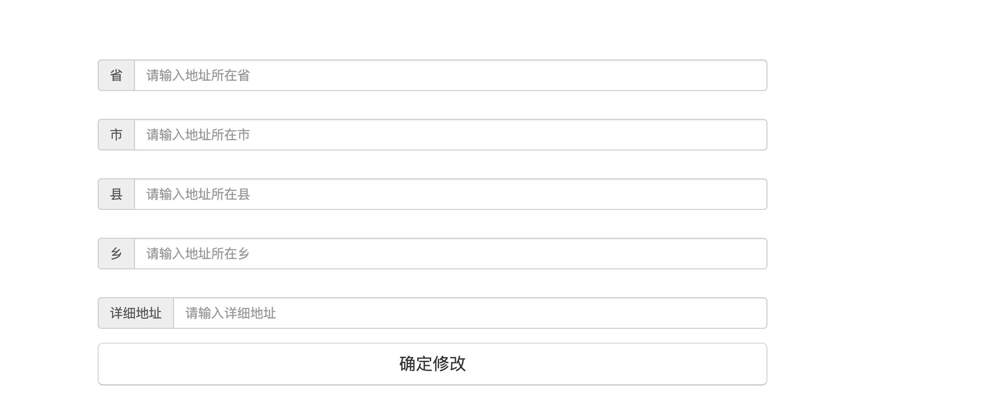

### 实现了点击修改地址后进入修改地址的界面

一个servlet,一个html

#### 大致思路：

前端：点击修改后进入修改界面--->然后输入相关地址信息--->提交并发送给servlet

servlet： 接收前端传递参数---->验证cookie是否有效(前面已说过，是以地址id为下划线组成的字符串，拆分再循环检查即可)---->update数据库即可

#### 技术难点：

1，servlet中的cookie验证：第一次做的时候一直接收不到前端传过来的cookie，多次尝试后，发现问题在于我的文件夹是在访问servlet的副文件夹上，这样导致了request的path不对，于是无法带着cookie一起传输。通过cookie.setPath()设置到最顶级目录下，便成功携带cookie访问。

2，前端页面跳转问题：在修改成功后，页面提示成功并自动返回前一页，我开始用的history.go(-1)，然后发现一个问题，当返回前一页后前一页不会刷新，这样导致上面还是原来的地址，而不是新的地址。最后的解决办法是，使用window.location.href = document.referer,即返回跳转到这个页面的前一个页面并自动刷新，成功解决。

还是一样，贴一张界面图：

